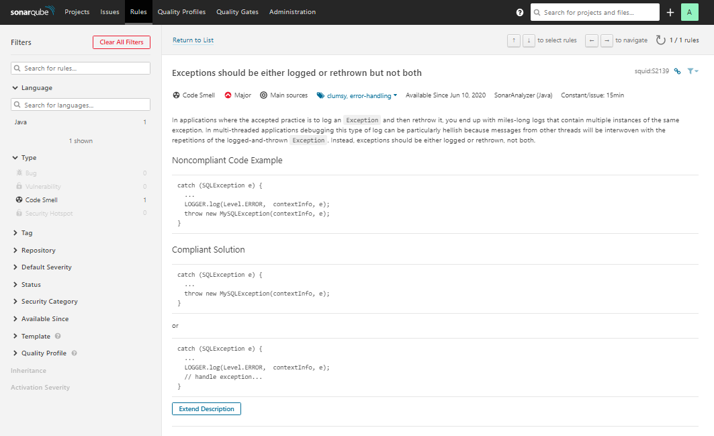
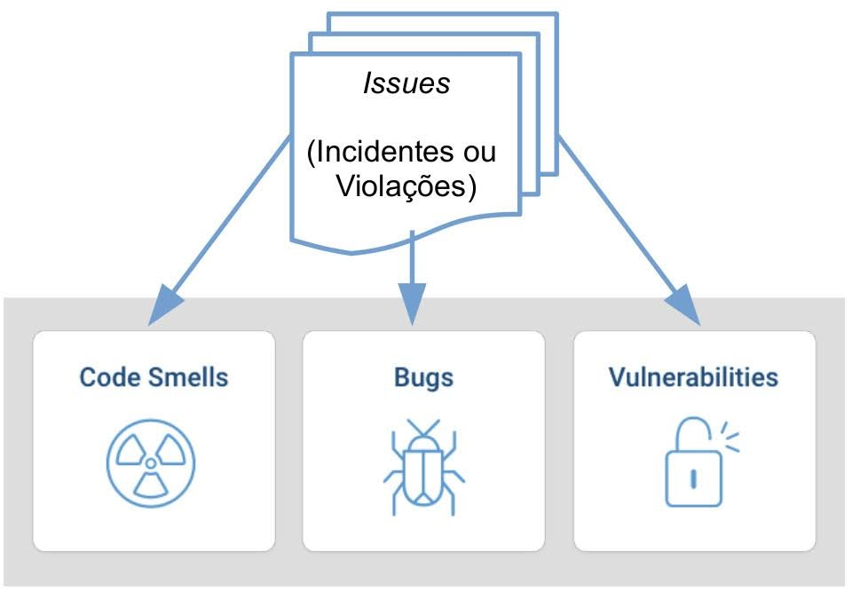
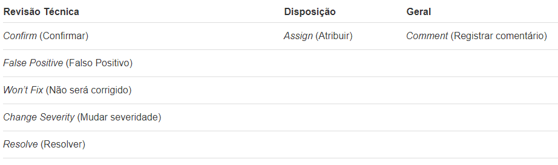
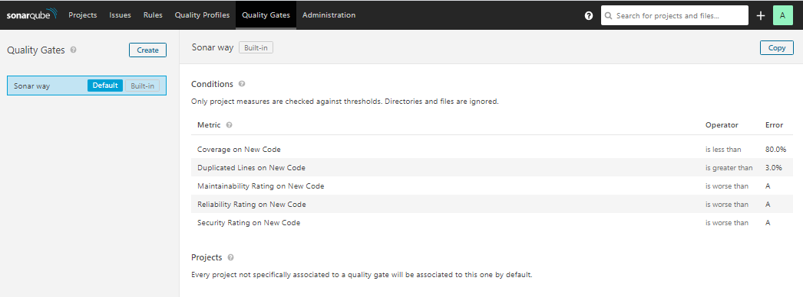

# Introdução

Neste workshop abordaremos a ferramenta SonarQube e como ela pode ser útil para a análise e melhoria de qualidade de código de suas aplicações.


# O que é SonarQube?

O SonarQube é uma plataforma de código aberto desenvolvida pela SonarSource, ele é usado por equipes de desenvolvimento para o gerenciamento da qualidade de código fonte.

O SonarQube fornece análise e integração totalmente automatizadas com Maven, Ant, Gradle, MSBuild e ferramentas de integração contínua ( Atlassian Bamboo, Jenkins, Hudson, etc).

Atualmente a versão gratuita do SonarQube (Community Edition) fornece suporte para 15 linguagens de programação distintas.


# Por que gerenciar a qualidade do código fonte?

Para responder essa pergunta leve em consideração a seguinte citação:

*“Um programa bem escrito é um programa em que o custo de implementação de um recurso é constante ao longo de toda a vida do programa” – Itay Maman*

Como uma introdução rápida, esta é a melhor definição de qualidade de código fonte. Fica ainda mais forte quando colocado o contrário: *um programa mal escrito é um programa onde o custo de implementação de uma característica cresce ao longo do tempo.*

Com isso podemos compreender a importância da qualidade de código fonte.


# Como gerenciar a qualidade do código fonte?

Existem alguns pontos técnicos que devem ser analisados quando se faz a análise de código fonte de um projeto sendo eles:

- Descumprimento dos padrões de codificação e de melhores práticas
- Duplicadas de código
- Componentes complexos ou/e má distribuição dos componentes entre complexidade
- Baixa cobertura de código, testes unitários, especialmente na parte complexa do programa
- Possíveis *bugs*
- Code Smells (Maus cheiros de código)

O SonarQube é capaz de identificar esses dentre outros problemas que podem afetar a qualidade do código fonte de uma aplicação.

O primeiro passo ao fazer gestão de qualidade do código fonte é definir qual desses pontos técnicos são mais importantes. 

Em seguida, com base na situação atual do projeto, estabelecer um plano para a melhoria contínua da qualidade do código fonte do projeto.


# Como o SonarQube funciona?

O SonarQube possui uma arquitetura bastante simples e flexível que é constituída por três componentes:

- Um conjunto de analisadores de código fonte que são acionados por demanda.

- Um banco de dados para mantêm os resultados de análises.

- Uma ferramenta *Web* para exibir painéis de qualidade de código sobre projetos, bugs, vulnerabilidades e etc.

  

Com esses componentes o SonarQube embarca as melhores ferramentas para analisar violações de regras de qualidade, bugs em potencial, cobertura de testes de unidade, violações de segurança, entre outros.


# Instalando o SonarQube

A instalação do SonarQube é bem simples.

O único requisito para utilização do SonarQube é possuir a versão correta do Java instalada em sua máquina.

Recomendamos o download da versão 7.8 pois ela é a versão mais recente com suporte para o Java 8, as demais versões exigem o Java 11.

Primeiro precisaremos acessar o seguinte este [link]( https://binaries.sonarsource.com/Distribution/sonarqube/sonarqube-7.8.zip) para realizar o download desta versão específica do SonarQube.  

Após realizar o download extraia o diretório **sonarqube-7.8** do arquivo **.zip** baixado.

Com o diretório **sonarqube-7.8** aberto acesse o diretório **bin**, dentro do diretório **bin** abra o subdiretório correspondente ao seu sistema operacional:


Nas versões **Linux** ou **MacOs** execute o arquivo **sonar.sh** para iniciar o SonarQube.

Na versão **Windows** execute o arquivo **StartSonar.bat**, na versão windows também é possível instalar o SonarQube como serviço executando o arquivo **InstallNTService.bat**.

Após iniciar o SonarQube acesse o seguinte endereço para acessar a interface Web do SonarQube: **http://localhost:9000**.

Com o SonarQube aberto veremos algo semelhante a isso:


# Efetuando login no SonarQube

Por padrão o login e senha do SonarQube são:

**Usuário: admin**

**Senha: admin**

Essa senha pode ser alterada posteriormente. Também poderemos criar usuários com permissões específicas para acessar o SonarQube.

Após efetuar o login no SonarQube veremos a seguinte tela:


Como ainda não criamos nenhum projeto no SonarQube não teremos nenhuma informação de projetos no painel.

Observe que possuímos alguns menus no SonarQube, abordaremos cada um deles posteriormente.


# Configurando o SonarScanner do Maven

 O SonarScanner é recomendado como o analisador padrão para projetos Maven. 

Para utilizá-lo é necessário realizar uma configuração global no Maven, para isso precisaremos editar o arquivo **settings.xml** localizado em  **$MAVEN_HOME/conf** ou **~/.m2**  para definir o prefixo do plug-in e, opcionalmente, o URL do servidor SonarQube. 

A configuração final será semelhante a isso:

```xml
<settings>
    <pluginGroups>
        <pluginGroup>org.sonarsource.scanner.maven</pluginGroup>
    </pluginGroups>
    <profiles>
        <profile>
            <id>sonar</id>
            <activation>
                <activeByDefault>true</activeByDefault>
            </activation>
            <properties>
                <sonar.host.url>
                  http://localhost:9000
                </sonar.host.url>
            </properties>
        </profile>
     </profiles>
</settings>
```


# Configurando um projeto Maven no SonarQube

Agora iremos configurar nosso primeiro projeto no SonarQube, para isso utilizaremos um projeto de exemplo que pode ser baixado no seguinte [link](/projeto-exemplo/api-produtos.zip).

O projeto de exemplo é uma API de produtos feita com Java e SpringBoot utilizando o gerenciador de dependências Maven.

Após extrair o projeto do arquivo **.zip** crie um arquivo chamado **sonar-project.properties** na pasta raiz do projeto com o seguinte conteúdo:

```properties
sonar.projectKey=com.example:api-produtos
sonar.projectVersion=1.0.0
sonar.sources=.
sonar.sourceEncoding=UTF-8
```

A propriedade **sonar.projectKey** define a chave exclusiva do projeto. O valor padrão para projetos Maven é **groupId: artifactId**

A propriedade **sonar.projectVersion** define a versão do projeto.

A propriedade **sonar.sources** define  caminhos separados por vírgula para diretórios que contêm arquivos do projeto.  Quando não fornecido o valor padrão é o diretório base do projeto.

A propriedade **sonar.sourceEncoding** define a codificação do sistema como  **UTF-8**.

Para saber mais sobre as propriedades de configuração disponíveis acesse este [link]( https://docs.sonarqube.org/7.8/analysis/analysis-parameters/ ).


Após a criação do arquivo **sonar-project.properties** abra um prompt de comando na pasta raiz do projeto e execute o seguinte comando:

```shell
mvn clean compile sonar:sonar
```

Após alguns minutos nosso projeto será compilado e criado no Sonar Qube.

Para visualizar os projetos criados acesse o seguinte link:  http://localhost:9000/projects

Abaixo um exemplo de como ficaria o projeto criado no SonarQube.


# Métricas

O SonarQube oferece uma série de métricas sobre a qualidade do código, entre elas estão:

- Complexidade (ciclomática e cognitiva)

- Código duplicado

- Quantidade de Problemas

- Tamanho (quantidade de linhas de código, número de classes, etc…)

- Cobertura de testes

- Índice de Manutenibilidade, Confiabilidade e Segurança

  

# Alguns conceitos do SonarQube 

Ao abrirmos o SonarQube pela primeira vez nos deparamos com uma séries de termos desconhecidos até o momento, neste tópico abordaremos cada um deles.


## Rules (Regras)

O SonarQube se baseia em regras pré-definidas para analisar o código. Uma regra ou Rule é uma boa prática e cada linguagem possui um grupo de regras relacionadas. Toda a regra possui uma descrição, normalmente, com exemplo de código e links para descrições mais detalhadas, o que ajuda o desenvolvedor a entender e resolver o problema relacionado, como mostra o exemplo abaixo:



Todas as regras pré-definidas no SonarQube podem ser acessadas através do menu **Rules**.


## Issues (Problemas)

Toda vez que um código quebra uma regra, uma *Issue* é gerada.

No menu Issues podemos verificar todas as Issues geradas de todos os projetos registrados no SonarQube.

Abaixo um exemplo da tela de Issues.


As *Issues* estão divididas nas seguintes categorias: 




- **Code Smells:** São problemas relacionados a manutenibilidade do código. Deixar isso como está significa que, na melhor das hipóteses, os desenvolvedores terão mais dificuldade do que deveriam para fazer alterações no código. Na pior das hipóteses, eles ficarão tão confusos com o estado do código que introduzirão mais erros à medida que fizerem alterações.

- **Bugs:** itens que representam erros no código que, se ainda não aconteceram em produção, provavelmente acontecerão, e no pior momento possível. Problemas desta categoria precisam ser corrigidos.

- **Vulnerabilities (Vulnerabilidades):** são fraquezas ou brechas de segurança na aplicação.

- Além dessas 3 categorias principais podemos ter também uma outra categoria chamada de **Security Hotspot** que se trata de uma vulnerabilidade referente a um código sensível à segurança da aplicação no qual o desenvolvedor precisa revisar. Após a revisão será definido se o ponto em específico é realmente uma vulnerabilidade de segurança a ser tratada.

  Para compreender detalhadamente sobre **Security Hotspots** acesse este [link]( https://docs.sonarqube.org/latest/user-guide/security-hotspots/ ).

  

As *Issues* também são classificadas por severidade, conforme a tabela abaixo: 


 Existem sete coisas diferentes que você pode fazer com uma *Issue* (além de corrigi-la!) 



- **Confirm (Confirmar):** ao confirmar um problema, você está basicamente dizendo “Sim, isso é um problema”. Ao fazê-lo, ele sai do status “Aberto” para “Confirmado”.
- **False Positive (Falso Positivo):** olhando para a questão em contexto, você percebe que, por qualquer motivo, esse problema não é realmente um problema. Então você marca como falso positivo e segue em frente.
- **Won’t Fix (Não será corrigido):** olhando para o problema no contexto, você percebe que, embora seja um problema válido, não é um problema que realmente precisa ser corrigido. Em outras palavras, representa dívida técnica aceita.
- **Change Severity (Mudar severidade):** este é o meio termo entre as duas opções anteriores. Sim, é um problema, mas não é um problema tão ruim quanto a gravidade padrão da regra diz. Ou talvez seja muito pior. De qualquer forma, você ajusta a gravidade do problema para adequá-lo ao que você acha correto.
- **Resolve (Resolver):** se você acha que resolveu um problema em aberto, pode escolher esta opção. Se você está certo, a próxima análise irá movê-lo para o status fechado. Se você estiver errado, o status será reaberto.
- **Assign (Atribuir):** depois que os problemas passarem pela revisão técnica, é hora de decidir quem vai lidar com eles. Por padrão, eles são atribuídos ao último *committer* no momento em que o problema é levantado, mas você pode reatribuí-lo a si mesmo ou a outra pessoa. O responsável receberá uma notificação por e-mail da tarefa se ele se inscreveu para notificações, e a atribuição será exibida em todos os lugares em que o problema for exibido.
- **Comment (Registrar comentário):** a qualquer momento durante o ciclo de vida de um problema, você pode registrar um comentário sobre ele. Comentários são exibidos nos detalhes do problema. Você pode editar ou excluir os comentários que você fez.


## Quality Profile (Perfil de Qualidade)

As *Issues* são geradas a partir das regras pré-definidas, que, por sua vez, estão relacionadas a um **Quality Profile (Perfil de Qualidade)**. Cada linguagem possui um perfil de qualidade associado. Além disso, o SonarQube permite extensão de perfis através de herança.

Somente usuários com permissão podem editar um perfil de qualidade

Para acessar os perfis de qualidade pré-definidos pelo SonarQube você pode acessar o menu **Quality Profiles**.

Um exemplo desta tela seria:


## Quality Gate (Meta de Qualidade)

Um *Quality Gate* (Meta de Qualidade) é uma meta que deve ser atingida antes que uma build possa ser liberada. Por exemplo:

**Posso liberar uma build hoje? Sim, desde que:**

- Os índices de Confiabilidade, Segurança e Manutenibilidade do novo código sejam = A

- 90% dos testes unitário passarem com sucesso

  

Somente usuários com permissão podem editar um Quality Gate.


Os Quality Gate pré definidos pelo SonarQube podem ser acessados através do menu **Quality Gates**.

Um exemplo desta tela seria:




# Acessando as informações e métricas de nossos projetos

## Menu Projects

Para verificar as métricas resumidas de nossos projetos podemos acessar o menu **Projects** onde veremos algo como o exemplo abaixo:


Podemos observar que o projeto de exemplo possui 0 bugs, 2 vulnerabilidades, 5 Code Smells, 0% de cobertura de código e 0.0% de duplicatas.

Podemos ver a nota de qualidade atribuída as categorias de Bugs, Vulnerabilidades e Code Smells, além disso podemos ver ao lado direito do nome do projeto o status do projeto referente ao Quality Gate pré definido pelo SonarQube.

Para ter uma visão mais detalhada clique no projeto **API de Produtos**.

Ao fazermos isso seremos redirecionados a página detalhada de métricas de nosso projeto conforme o exemplo abaixo:


nos próximos tópicos abordaremos cada um dos Sub menus do detalhamento de um projeto.


## Sub menu Overview

Apresenta uma visão geral de nosso projeto.


## Sub menu Issues

Apresenta as informações de Issues do projeto selecionado.


## Sub menu Measures

O menu **Measures** apresenta algumas medições do projeto em uma visão geral e em outras visões conforme podemos observar neste exemplo:


Além da visão geral das medições do projeto também possuímos medições de:

* **Reliability (Confiabilidade)**: Nesta categoria são marcados alguns pontos a nível de código no qual você poderá obterá um comportamento diferente do esperado.

* **Security (Segurança)**: Nesta categoria são marcados a nível de código possíveis pontos fracos para hackers. 

* **Maintainability (Manutenibilidade)**: Nesta categoria são marcados a nível de código pontos da aplicação no qual a manutenibilidade será mais difícil do que deveria.

* **Coverage (Cobertura)**: Nesta categoria serão marcados a nível de código pontos da aplicação que não possuem cobertura de testes automatizados.

* **Duplications (Duplicatas)**: Nesta categoria são marcados a nível de código fonte pontos da aplicação destacados como duplicatas dentro da aplicação e a densidade dessas duplicatas de código em toda a aplicação.

* **Size (Tamanho)**: Fornece uma medição de Linhas de código, Métodos, Funções, Classes, Arquivos, Linhas comentadas e porcentagem de comentários do projeto.

  Exemplo:

  

* **Complexity (Complexidade)**: Quão simples ou complicado é o fluxo de controle do aplicativo. 
  Esta categoria fornece a medição de **Complexidade Ciclomática** e **Complexidade Cognitiva**.
  A **complexidade ciclomática** mede o número mínimo de casos de teste necessários para a cobertura total do teste. 
  A **complexidade cognitiva** é uma medida de quão difícil é de se entender o aplicativo.

  Exemplo:

  

  

* **Issues (Problemas)**: Esta categoria fornece uma visão geral sobre os Issues do projeto e seu status atual.

  Exemplo:

  


## Sub menu Code

Fornece a visão do código do aplicativo e uma medição de:

* Linha de código
* Bugs
* Vulnerabilidades
* Code Smells
* Security Hotspots
* Cobertura de código
* Duplicatas


Exemplo:


## Sub menu Activity

Fornece uma visão geral do histórico de atividade do projeto a cada vez que o mesmo é analisado pelo SonarQube.

Nele podemos ver um histórico do projeto referente a melhorias ou pioras de acordo com as métricas do SonarQube como aumento ou diminiuição de Bugs, Code Smells e etc.

Exemplo:


## Sub menu Administration

Neste sub menu existem uma série de outros sub menus relacionados a administração do projeto no SonarQube.

Exemplo:


Podemos observar que neste sub menu possuímos outros sub menus referentes a:

* **General Settings**: Configurações gerais do projeto.

* **Quality Profiles**: Permite escolher qual perfil estará associado ao projeto, idioma por idioma.

* **Quality Gate**: Permite escolher qual Quality Gate estará associado ao projeto.

* **Custom Measures (Medições personalizadas)**: Permite atualizar os valores das métricas personalizadas para este projeto. As alterações entrarão em vigor na próxima análise do projeto. Métricas personalizadas devem ser criadas em nível global.

  Uma observação importante é que este menu está marcado para remoção em versões futuras do SonarQube.

* **Links**: Permite editar alguns links associados ao projeto.

* **Permissions (Permissões)**: Permite conceder e revogar permissões no nível do projeto. As permissões podem ser concedidas a grupos ou usuários individuais.

* **Background Tasks (Tarefas de segundo plano)**: Esta página permite o monitoramento da fila de tarefas em execução de forma assíncrona no servidor do SonarQube. Também fornece acesso ao histórico de tarefas concluídas e seu status. O processamento do relatório de análise é o tipo mais comum de tarefa em segundo plano.

* **Update Key**: Permite alterar a chave de identificação que definimos para o projeto.

* **Webhooks**: Os webhooks são usados para notificar serviços externos quando uma análise de projeto é feita. Uma solicitação HTTP POST incluindo uma carga JSON é enviada para cada um dos URLs fornecidos.

* **Deletion (Deleção)**: Permite realizar a deleção do projeto no SonarQube.


# Visão geral menu Administração

Neste tópico veremos uma visão geral do que o menu Adminstração tem a oferecer.

Ao acessarmos o menu adminstração veremos algo semelhante a isso:


Observe que no menu administração existem outros 5 submenus.


## Menu Configuration e seus sub menus

O menu **Configuration** possui alguns submenus que fornecem as seguinte funcionalidades:

* **General Settings**: Configurações global da instância SonarQube

* **Encryption**: Fornece a possibilidade de gerar chaves secretas no SonarQube.

* **Custom Metrics**: Fornece a possibilidade de criar métrica personalizadas para todos os projetos do SonarQube

  

## Menu Security e seus sub menus

O menu **Security** possui alguns submenus que fornecem as seguinte funcionalidades:

* **Users**: Permite criar e administrar usuários individuais no SonarQube.
* **Groups**: Permite criar e administrar grupos de usuários no SonarQube.
* **Global Permissions**: Permite conceder e revogar permissões para fazer alterações a nível global. Essas permissões incluem editar perfis de qualidade, executar análises e executar a administração global do sistema.
* **Permission Templates**: Permite gerenciar templates de permissões para projetos.


## Menu Projects e seus sub menus

O menu **Projects** referente ao menu **Administration** possui alguns submenus que fornecem as seguinte funcionalidades:

* **Management**: Permite gerenciar todos os projetos cadastrados no SonarQube.

* **Background Tasks (Tarefas de segundo plano)**: Permite o monitoramento global da fila de tarefas em execução de forma assíncrona do servidor do SonarQube. Também fornece acesso ao histórico de tarefas concluídas e seu status. O processamento do relatório de análise é o tipo mais comum de tarefa em segundo plano.

  

## Menu System

Fornece uma série de informações sobre o servidor SonarQube, alem de possibilitar o download de logs e informações do servidor.

Neste menu também é possível reiniciar o servidor SonarQube.

Exemplo:


## Menu Marketplace

Este menu fornece a possibilidade de realizar o download de plugins para o SonarQube.

Basta pesquisar e instalar o plugin.

Exemplo:

