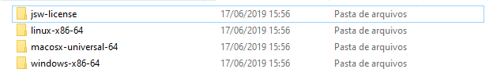
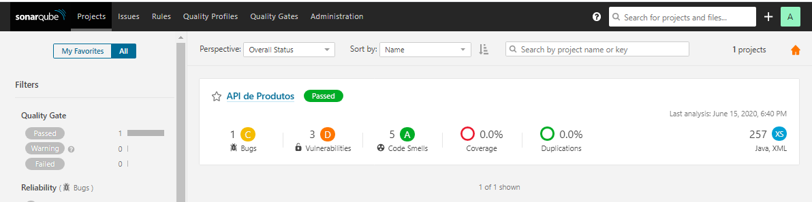

# Introdução

Neste workshop abordaremos a ferramenta SonarQube e como ela pode ser útil para a análise e melhoria de qualidade de código de suas aplicações.

# O que é SonarQube?

O SonarQube é uma plataforma de código aberto desenvolvida pela SonarSource, ele é usado por equipes de desenvolvimento para o gerenciamento da qualidade de código fonte.

O SonarQube fornece análise e integração totalmente automatizadas com Maven, Ant, Gradle, MSBuild e ferramentas de integração contínua ( Atlassian Bamboo, Jenkins, Hudson, etc).

Atualmente a versão gratuita do SonarQube (Community Edition) fornece suporte para 15 linguagens de programação distintas.

# Por que gerenciar a qualidade do código fonte?

Para responder essa pergunta leve em consideração a seguinte citação:

*“Um programa bem escrito é um programa em que o custo de implementação de um recurso é constante ao longo de toda a vida do programa” – Itay Maman*

Como uma introdução rápida, esta é a melhor definição de qualidade de código fonte. Fica ainda mais forte quando colocado o contrário: *um programa mal escrito é um programa onde o custo de implementação de uma característica cresce ao longo do tempo.*

Com isso podemos compreender a importância da qualidade de código fonte.

# Como gerenciar a qualidade do código fonte?

Existem alguns pontos técnicos que devem ser analisados quando se faz a análise de código fonte de um projeto sendo eles:

- Descumprimento dos padrões de codificação e de melhores práticas
- Duplicadas de código
- Componentes complexos ou/e má distribuição dos componentes entre complexidade
- Baixa cobertura de código, testes unitários, especialmente na parte complexa do programa
- Possíveis *bugs*

O SonarQube é capaz de identificar esses dentre outros problemas que podem afetar a qualidade do código fonte de uma aplicação.

O primeiro passo ao fazer gestão de qualidade do código fonte é definir qual desses pontos técnicos são mais importantes. 

Em seguida, com base na situação atual do projeto, estabelecer um plano para a melhoria contínua da qualidade do código fonte do projeto.

# Como o SonarQube funciona?

O SonarQube possui uma arquitetura bastante simples e flexível que é constituída por três componentes:

- Um conjunto de analisadores de código fonte que são acionados por demanda.

- Um banco de dados para mantêm os resultados de análises.

- Uma ferramenta *Web* para exibir painéis de qualidade de código sobre projetos, bugs, vulnerabilidades e etc.

  

Com esses componentes o SonarQube embarca as melhores ferramentas para analisar violações de regras de qualidade, bugs em potencial, cobertura de testes de unidade, violações de segurança, entre outros.

# Instalando o SonarQube

A instalação do SonarQube é bem simples.

O único requisito para utilização do SonarQube é possuir a versão correta do Java instalada em sua máquina.

Recomendamos o download da versão 7.8 pois ela é a versão mais recente com suporte para o Java 8, as demais versões existem o Java 11.

Primeiro precisaremos acessar o seguinte este [link]( https://binaries.sonarsource.com/Distribution/sonarqube/sonarqube-7.8.zip) para realizar o download desta versão do SonarQube.  

Após realizar o download extraia o diretório **sonarqube-7.8** do arquivo **.zip** baixado.

Com o diretório **sonarqube-7.8** aberto acesse o diretório **bin**, dentro do diretório **bin** abra o subdiretório correspondente ao seu sistema operacional:

Nas versões **Linux** ou **MacOs** execute o arquivo **sonar.sh** para iniciar o SonarQube.

Na versão **Windows** execute o arquivo **StartSonar.bat**, na versão windows também é possível instalar o SonarQube como serviço executando o arquivo **InstallNTService.bat**.

Após iniciar o SonarQube acesse o seguinte endereço para acessar o SonarQube: **http://localhost:9000**.

Com o SonarQube aberto veremos algo semelhante a isso:

# Efetuando login no SonarQube

Por padrão o login e senha do SonarQube são:

**Usuário: admin**

**Senha: admin**

Essa senha pode ser alterada posteriormente.

Após efetuar o login no SonarQube veremos a seguinte tela:

Como ainda não criamos nenhum projeto no SonarQube não teremos nenhuma informação de projetos no painel.

# Configurando um projeto Maven no SonarQube

Agora iremos configurar nosso primeiro projeto no SonarQube, para isso utilizaremos um projeto de exemplo que pode ser baixado no seguinte **link[ALGUM LINK AQUI]**.

O projeto de exemplo é uma API de produtos feita com Java e SpringBoot utilizando o gerenciador de dependências Maven.

Após extrair o projeto para sua máquina abra um prompt de comando na pasta do projeto.

Volte ao SonarQube e no canto superior direito clique no botão **+** e escolha a opção **Create new project** conforme o exemplo abaixo:

Após isso será solicitado que você crie um **Project Key** e defina um **Display Name** conforme o exemplo abaixo:

O **Project Key** é um identificador exclusivo para o seu projeto.

A recomendação do SonarQube para projetos Maven é definir a chave no seguinte formato: **groupId: artifactId**.

**Display Name** é utilizado para definir o nome do projeto no SonarQube.

Para fins didáticos definimos **Project Key** como **com.tdc:api-produtos** e **Display Name** como **API de Produtos**.

Após isso você será redirecionado para a seguinte tela:

Conforme podemos observar foi requisitado pelo SonarQube um token, este token é usado para identificá-lo quando uma análise é realizada. 

Para fins didáticos definiremos este token com o valor **api-produtos**, após isso clique no botão **Generate**.

Podemos observar no exemplo abaixo que o SonarQube gerou um Token a partir do valor que passamos a ele na etapa anterior:

Clique no botão **Continue** para continuarmos.

Em seguida será solicitado que você informe qual a linguagem principal do projeto em questão:

No nosso caso é um projeto **Java**, com isso selecione a opção **Java**.

Depois de selecionar a linguagem principal do projeto o SonarQube irá pergunta qual tecnologia está sendo utilizada para realizar o build do projeto, podemos ver no exemplo abaixo as opções **Maven** e **Gradle**.

Nosso projeto é um projeto **Maven**, com isso escolha a opção **Maven**.

Em seguida o SonarQube irá nos fornecer um comando **Maven** para executarmos a análise de nosso projeto:

Copie esse código, abra o prompt de comando e navegue até o diretório de nosso projeto de exemplo.

Em seguida cole o comando copiado e pressione **Enter** para executar o mesmo.